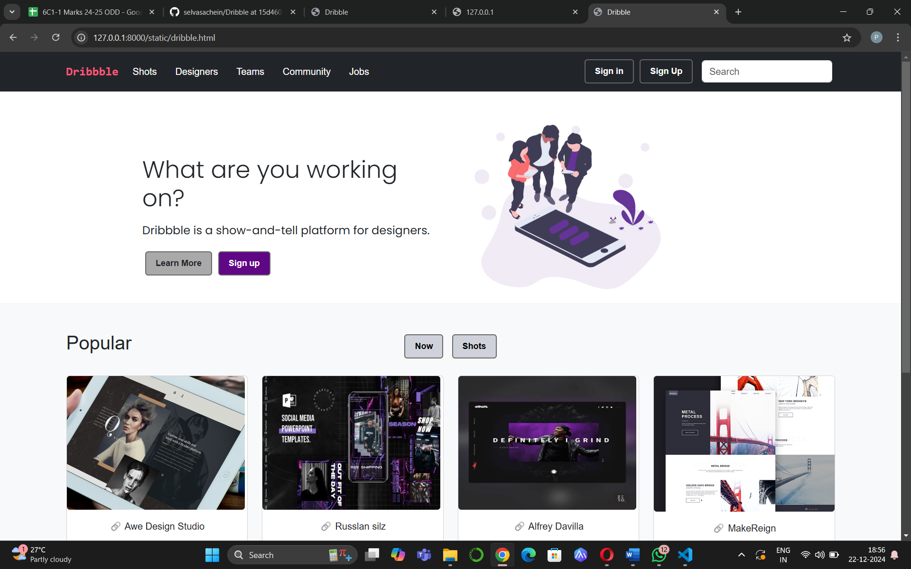
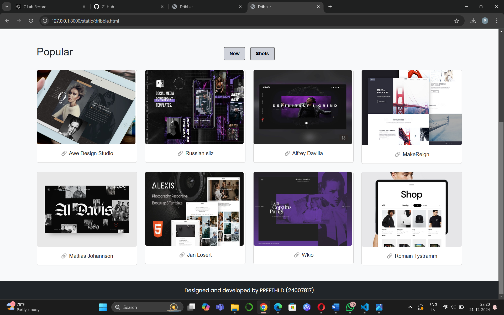

# Project Responsive Web Design using Bootstrap
## Date:21-12-2024

## AIM:
To create a simplified clone of Dribbble (https://dribbble.com/) landing page.


## DESIGN STEPS:

### Step 1:
Clone the repository from GitHub.

### Step 2:
Create Django Admin project.

### Step 3:
Create a New App under the Django Admin project.

### Step 4:
Insert the necessary CSS and JavaScript files as external in order to use Bootstrap.

### Step 5:
Create a HTML file and include the needed Bootstrap components.

### Step 6:
Publish the website in the LocalHost.

## PROGRAM :
html content
```
<html>
    <meta charset="UTF-8">
<head>
    <title>Dribble </title>
    <link href="https://cdn.jsdelivr.net/npm/bootstrap@5.3.2/dist/css/bootstrap.min.css" rel="stylesheet">
    <link rel="stylesheet" href="dribble.css">
</head>
<body>
 <nav class="navbar navbar-expand-lg navbar-light bg-dark">
    <div class="container d-flex align-items-center justify-content-between">
        <a class="navbar-brand" href="#">Dribbble</a>
        <button class="navbar-toggler" type="button" data-bs-toggle="collapse" data-bs-target="#navbarNav">
            <span class="navbar-toggler-icon"></span>
        </button>
        <div class="collapse navbar-collapse" id="navbarNav">
            <ul class="navbar-nav me-auto">
                <li class="nav-item"><a class="nav-link" href="#">Shots</a></li>
                <li class="nav-item"><a class="nav-link" href="#">Designers</a></li>
                <li class="nav-item"><a class="nav-link" href="#">Teams</a></li>
                <li class="nav-item"><a class="nav-link" href="#">Community</a></li>
                <li class="nav-item"><a class="nav-link" href="#">Jobs</a></li>
            </ul>
        </div>
        <a class="btn  text-white" href="#">Sign in</a>
        <a class="btn  text-white" href="#">Sign Up</a>
        <input type="search" class=" form-control fs-8" style="margin: 7px; width: 150px; margin-right:7px ;" placeholder="Search">
    </div>
    
    </nav>
    <section id="home" style="background-color: white;">
       <div class="row" style="background-color: white;">
            <div class="col-lg-6 col-md-6 col-12 order-1 pt-5" style="background-color: white;">
               
                    <h1 class="display-4">What are you working on?</h1>
                    <p class="my-lg-3 my-3">Dribbble is a show-and-tell platform for designers.</p>
                        <button class="btn" style="background-color: darkgray;">Learn More</a>
                        <button class="btn text-white" style="background-color: rgb(96, 7, 134);">Sign up</a>
            </div>
                    <div class="col-lg-6 col-md-6 col-12 py-lg-0 py-3 order-sm-2">
                        
                    </div>
            
        </div>
    </section>
    
    <section class="py-5">
        <div class="container"">
            <div class="row mb-4">
                <div class="col-md-4">
                    <h2 class="mb-0">Popular</h2>
                </div>
                <div class="col-md-4 text-center">
                    <button class="btn btn-light btn-sm" style="background-color: #cfd2da;">Now</button>
                    <button class="btn btn-light btn-sm" style="background-color: #cfd2da;">Shots</button>
                </div>
            </div>
            <div class="row g-4">
                <div class="col-md-3 col-sm-6">
                    <div class="card shot-card">
                        
                      
                        <div class="card-body text-center">
                            <p class="card-text mb-0">🔗 Awe Design Studio</p>
                        </div>
                    </div>
                </div>
                <div class="col-md-3 col-sm-6">
                    <div class="card shot-card">
                        
                        
                        <div class="card-body text-center">
                            <p class="card-text mb-0">🔗 Russlan silz</p>
                        </div>
                    </div>
                </div>
                <div class="col-md-3 col-sm-6">
                    <div class="card shot-card">
                        
                        <div class="card-body text-center">
                            <p class="card-text mb-0">🔗 Alfrey Davilla</p>
                        </div>
                    </div>
                </div>
                <div class="col-md-3 col-sm-6">
                    <div class="card shot-card">
                        
                       
                        <div class="card-body text-center">
                            <p class="card-text mb-0">🔗 MakeReign</p>
                        </div>
                    </div>
                </div>
                <div class="col-md-3 col-sm-6">
                    <div class="card shot-card">
                        
                        <div class="card-body text-center">
                            <p class="card-text mb-0">🔗 Mattias Johannson</p>
                        </div>
                    </div>
                </div>
                <div class="col-md-3 col-sm-6">
                    <div class="card shot-card">
                        
                        
                        <div class="card-body text-center">
                            <p class="card-text mb-0">🔗 Jan Losert</p>
                        </div>
                    </div>
                </div>
                <div class="col-md-3 col-sm-6">
                    <div class="card shot-card">
                        
                        <div class="card-body text-center">
                            <p class="card-text mb-0">🔗 Wkio</p>
                        </div>
                    </div>
                </div>
                <div class="col-md-3 col-sm-6">
                    <div class="card shot-card">
                        
                        <div class="card-body text-center">
                            <p class="card-text mb-0">🔗 Romain Tystramm</p>
                        </div>
                    </div>
                </div>
            </div>
        </div>
    </section>
    <footer class="bg-dark text-white py-3">
        <div class="container text-center">
            <p class="mb-0">Designed and developed by PREETHI D (24007817)</p>
        </div>
    </footer>
    <script src="https://cdn.jsdelivr.net/npm/bootstrap@5.3.2/dist/js/bootstrap.bundle.min.js"></script>
</body>
</html>
```
css content (other than bootstrap used)

```
@import url('https://fonts.googleapis.com/css2?family=Inter:ital,opsz,wght@0,14..32,100..900;1,14..32,100..900&family=Merriweather:ital,wght@0,300;0,400;0,700;0,900;1,300;1,400;1,700;1,900&family=Poppins:ital,wght@0,100;0,200;0,300;0,400;0,500;0,600;0,700;0,800;0,900;1,100;1,200;1,300;1,400;1,500;1,600;1,700;1,800;1,900&display=swap');
body {
    background-color:#ffffff;
    font-family: Arial, Helvetica, sans-serif;
}
.navbar-brand {
    font-weight: bold;
    color: #ff5678;
    font-family: monospace;
}
.nav-link {
    color:white!important;
    margin-right: 15px;
}
.btn
{
    padding: 8px 16px;
    font-size: 0.9rem;
    margin:5px;
    border: 2px solid #666;
    border-radius: 5px;
    font-weight: bold;
}
#home .container {
    gap: 20px; /
}
.img-content img {
    max-width:50%;
    height: 50px;
}
.btn-primary:hover {
    background-color: #cfd2da;
    box-shadow: 0 4px 8px rgba(0, 0, 0, 0.2);
}
section{
    min-height: 10vh;
    display: flex;
    justify-content: center;
    align-items: center;
    background-color: #f8f9fa;
    font-family: Arial, Helvetica, sans-serif;
}
.navbar-brand {
    font-weight: bold;
    color: #ff5678 !important;
    font-family: monospace;
}
.nav-link {
    color:white!important;
    margin-right: 15px;
}
#home .container {
    gap: 5px; 
    display: flex; 
    justify-content: center; 
    align-items: center; 
    text-align: center; 
}
#home img {
    max-width: 70%;
    height: auto;
    margin-top: 20px;
}
.btn-primary:hover {
    background-color: #cfd2da;
    box-shadow: 0 4px 8px rgba(0, 0, 0, 0.2);
}
section{
    min-height: 30vh;
    display: flex;
    justify-content: center;
    margin-top: 20px;
}
.shot-card img {
    border-radius: 5px;
}
.shot-card {
    transition: transform 0.2s ease-in-out;
}
.shot-card:hover {
    transform: scale(1.05);
    box-shadow: 0 4px 10px rgba(0, 0, 0, 0.2);
}
footer {
    background-color: #ffffff;
    color: #333;
    padding: 20px 0;
    text-align: center;
}
.hero-section h1 {
    font-size: 2.5rem;
    color: #333;
}
.hero-section p {
    font-size: 1.2rem;
    margin-bottom: 20px;
    color: #666;
}
.shot-card img {
    border-radius: 5px;
    
}
.shot-card {
    transition: transform 0.2s ease-in-out;
}
.shot-card:hover {
    transform: scale(1.05);
    box-shadow: 0 4px 10px rgba(0, 0, 0, 0.2);
}

footer {
   font-family:'Poppins', sans-serif;
    padding: 20px 0;
    text-align: center;
}

#home .row {
    width: 70%;
    max-width: 1200px; 
    margin: 0 auto; 
}

#home h1 {
    font-size: 2.5rem; 
    font-weight: 40 bold;
    margin-top: 40px;
    margin-right: 3px;
    font-family: 'Poppins', sans-serif;
}

#home p {
    font-size: 1.2rem;
    margin-bottom: 20px;
    font-family: 'Poppins', sans-serif;
}

```
## OUTPUT:

   
   


## RESULT:
The Project for responsive web design using Bootstrap is completed successfully.
